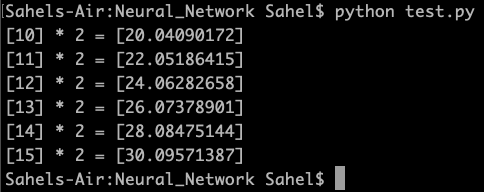

# Neural_Network

Current version can train only a linear regressor (neural network with no hidden layers). The output from such a regressor trained on multiplication by 2 is shown below.

The training data consisted of 0-9, while 10-15 were used for testing.

The next obvious step is to implement a general backtracking algorithm that can deal with hidden layers.
